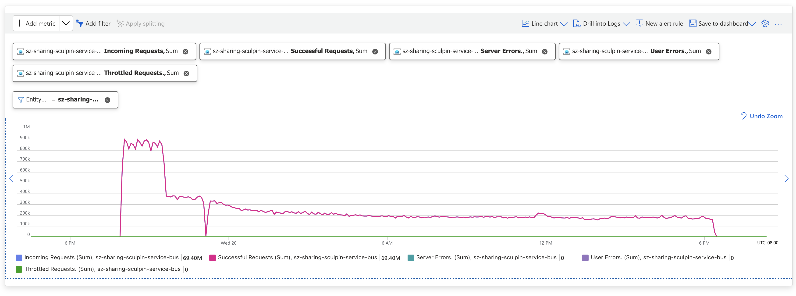
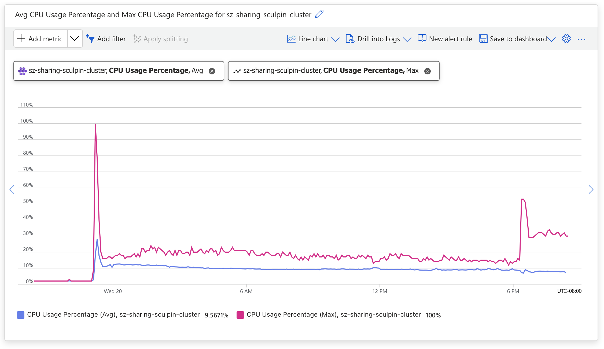
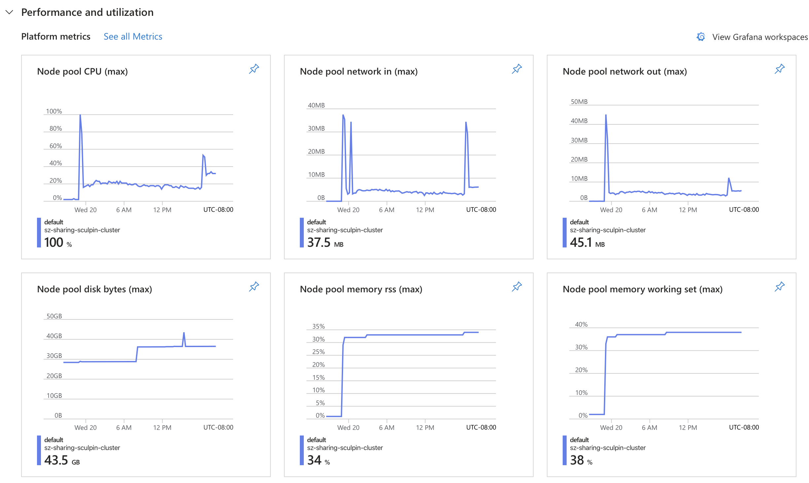
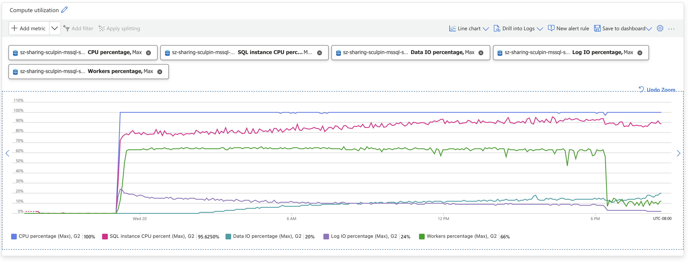
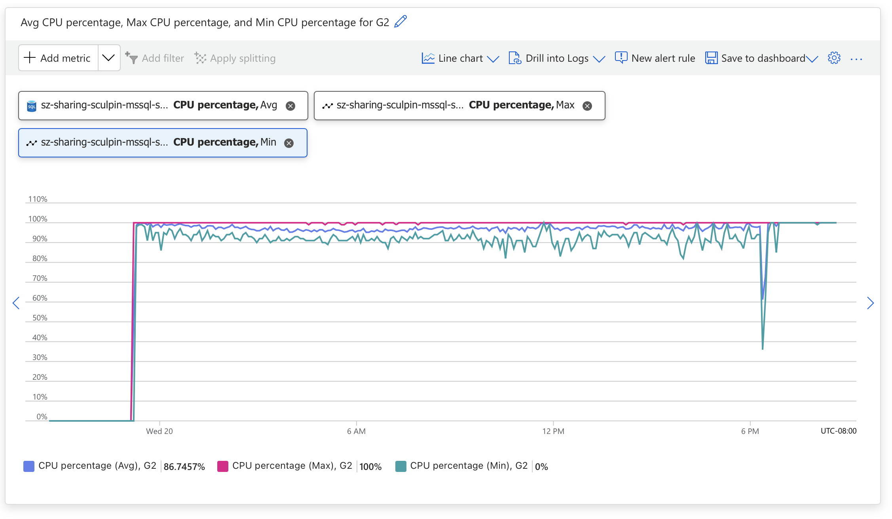
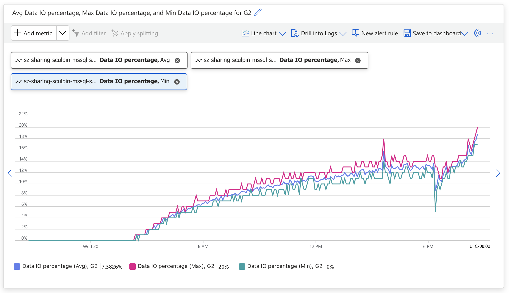

# azure-test-results-20241120-25M-senzing-3.12.3

## Contents

1. [Overview](#overview)
1. [Results](#results)
    1. [Observations](#observations)
    1. [Final metrics](#final-metrics)
        1. [Service Bus](#service-bus)
        1. [AKS](#aks)
        1. [RDS](#rds)
        1. [Logs](#logs)

## Overview

1. Performed: Nov 20, 2024
2. Senzing version: 3.12.3.24323
3. Instructions:
   [azure-performance-testing](https://github.com/senzing-garage/azure-performance-testing)
    1. [Terraform and AKS](https://github.com/senzing-garage/azure-performance-testing/tree/main/perf.tf)
4. Changes:
    1.

## System

1. Database
    1. Azure SQL
    1. Hyperscale: Gen5, 16 vCores
    1. Single database

## Results

### Observations

1. Inserts per second:
    1. Average over entire run: 336/second
    1. Time to load 25M: 17.87 hours
    1. Records in dead-letter queue: 0

Note:  Withinfo disabled.

- Max Stream-loader tasks: 50 observed, max set to 50
- Max Redoer tasks: 10 observed, max set to 50

### Final metrics

#### Service Bus

##### Service bus queue metrics



#### AKS

##### AKS CPU



##### AKS nodes metrics



#### RDS

##### Azure SQL database Metrics





#### Logs

```
root@sz-tools-77fd97444-4848q:/# sqlcmd -S $AZURE_ANIMAL-mssql-server.database.windows.net -d G2 -U senzing -P "$SENZING_DB_PWD" -I  -Q "SELECT GETDATE(), COUNT(*) FROM DSRC_RECORD;"

----------------------- -----------
2024-11-21 03:53:05.990    21622221

(1 rows affected)
root@sz-tools-77fd97444-4848q:/# sqlcmd -S $AZURE_ANIMAL-mssql-server.database.windows.net -d G2 -U senzing -P "$SENZING_DB_PWD" -I  -Q "SELECT GETDATE(), COUNT(*) FROM OBS_ENT;"

----------------------- -----------
2024-11-21 03:54:30.673    21102528

(1 rows affected)
root@sz-tools-77fd97444-4848q:/# sqlcmd -S $AZURE_ANIMAL-mssql-server.database.windows.net -d G2 -U senzing -P "$SENZING_DB_PWD" -I  -Q "SELECT GETDATE(), COUNT(*) FROM RES_ENT;"

----------------------- -----------
2024-11-21 03:55:44.560    17965655

(1 rows affected)
root@sz-tools-77fd97444-4848q:/# sqlcmd -S $AZURE_ANIMAL-mssql-server.database.windows.net -d G2 -U senzing -P "$SENZING_DB_PWD" -I  -Q "SELECT GETDATE(), COUNT(*) FROM RES_ENT_OKEY;"

----------------------- -----------
2024-11-21 03:56:20.777    21102529

(1 rows affected)
root@sz-tools-77fd97444-4848q:/# sqlcmd -S $AZURE_ANIMAL-mssql-server.database.windows.net -d G2 -U senzing -P "$SENZING_DB_PWD" -I  -Q "SELECT GETDATE(), COUNT(*) FROM SYS_EVAL_QUEUE;"

----------------------- -----------
2024-11-21 03:57:03.377      946735

(1 rows affected)
root@sz-tools-77fd97444-4848q:/# sqlcmd -S $AZURE_ANIMAL-mssql-server.database.windows.net -d G2 -U senzing -P "$SENZING_DB_PWD" -I  -Q "SELECT GETDATE(), COUNT(*) FROM RES_RELATE;"

----------------------- -----------
2024-11-21 03:57:25.757    10965995

(1 rows affected)
root@sz-tools-77fd97444-4848q:/# sqlcmd -S $AZURE_ANIMAL-mssql-server.database.windows.net -d G2 -U senzing -P "$SENZING_DB_PWD" -I  -Q "select min(first_seen_dt) load_start, count(*)/(DATEDIFF_BIG(SECOND, min(first_seen_dt), max(first_seen_dt))/60) erpm, count(*) total, max(first_seen_dt)-min(first_seen_dt) duration, count(*)/DATEDIFF_BIG(SECOND, min(first_seen_dt), max(first_seen_dt)) avg_erps from dsrc_record;"
load_start              erpm                 total       duration                avg_erps
----------------------- -------------------- ----------- ----------------------- --------------------
2024-11-20 07:09:00.780                18753    21622221 1900-01-01 19:13:23.620                  312

(1 rows affected)
root@sz-tools-77fd97444-4848q:/# sqlcmd -S $AZURE_ANIMAL-mssql-server.database.windows.net -d G2 -U senzing -P "$SENZING_DB_PWD" -I  -Q "select dr.RECORD_ID,oe.OBS_ENT_ID,reo.RES_ENT_ID from DSRC_RECORD dr left outer join OBS_ENT oe ON dr.dsrc_id = oe.dsrc_id and dr.ent_src_key = oe.ent_src_key left outer join RES_ENT_OKEY reo ON oe.OBS_ENT_ID = reo.OBS_ENT_ID where reo.RES_ENT_ID is null;"

RECORD_ID                                                                                                                                                                                                                                                  OBS_ENT_ID           RES_ENT_ID
---------------------------------------------------------------------------------------------------------------------------------------------------------------------------------------------------------------------------------------------------------- -------------------- --------------------

(0 rows affected)
root@sz-tools-77fd97444-4848q:/# sqlcmd -S $AZURE_ANIMAL-mssql-server.database.windows.net -d G2 -U senzing -P "$SENZING_DB_PWD" -I  -Q "select dr.RECORD_ID,reo.OBS_ENT_ID,reo.RES_ENT_ID from RES_ENT_OKEY reo left outer join OBS_ENT oe ON oe.OBS_ENT_ID = reo.OBS_ENT_ID  left outer join DSRC_RECORD dr  ON dr.dsrc_id = oe.dsrc_id and dr.ent_src_key = oe.ent_src_key where dr.RECORD_ID is null;"
RECORD_ID                                                                                                                                                                                                                                                  OBS_ENT_ID           RES_ENT_ID
---------------------------------------------------------------------------------------------------------------------------------------------------------------------------------------------------------------------------------------------------------- -------------------- --------------------

(0 rows affected)
```
